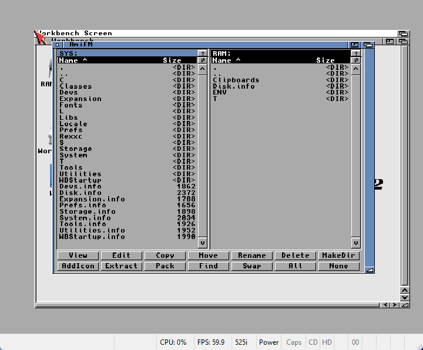

# amifm — Amiga File Manager

A dual-pane file manager for **AmigaOS 3.x**, inspired by DirWork/Directory Opus
but with a deliberately simpler, more modern UX. Written in C, built with the
[bebbo](https://github.com/bebbo/amiga-gcc) `m68k-amigaos-gcc` cross-compiler,
using Intuition + GadTools (no MUI).



It is small (~46 KB) and self-contained: the UI, navigation and file operations
are hand-rolled, while the heavy lifting (viewing, archiving) is delegated to
proven, already-installed Amiga tools — see **[Dependencies](#dependencies)**.

---

## Features

- **Dual custom-drawn listers** — pixel-aligned `Name | Size` columns, headers,
  `<DIR>` markers, drawers grouped first, no clipping. The full path + size +
  date of the selected item is shown in the title bar.
- **Navigation** — double-click or `..`/`.` rows (Unix-style: `..` = up / volume
  picker at a root, `.` = reload). Per-pane **↑ Parent** and **⇄ Reload** gadgets
  sit above each scrollbar. Click a path bar to open the volume picker.
- **Volume picker** — lists volumes, devices (DH0:/DF0:/RAM:/…) and assigns
  (C:/S:/LIBS:/…); resizable and scrollable.
- **Column sorting** — click `Name`/`Size` to sort, click again to reverse.
- **Tagging** — Shift-click to multi-select; **All**/**None**; batch ops act on
  the tagged set (or the cursor row if nothing is tagged). Click a selected row
  again to deselect.
- **File operations** — Copy, Move, Rename, Delete, MakeDir, **Add Icon** (gives
  a drawer the system-default folder icon), Swap panes.
- **Smart open** — double-click is type-aware: enter drawer / extract archive /
  view file.
- **View / Edit / Extract / Pack** — delegated to system tools (see below).
- **Find** — recursive name / `#?` pattern search; click a result to jump to it.
- **Custom scrollbars**, window resize with full reflow, right-button **menu**
  (amifm / Selection / Pane) including **Iconify** to a Workbench AppIcon.
- **Colour GlowIcon** — ships with a hand-built OS 3.5/3.2 colour icon
  (`amifm.info`) with a gold glow-on-select, matching the GlowIcons look.

---

## Dependencies

amifm itself only needs core OS libraries. The View/Edit/Extract/Pack actions
**shell out** to standard Amiga tools — install the ones for the features you
want. If a tool is missing, only that action is affected; the rest of amifm
works fine.

### Core (required)

| Library | Min version | Purpose |
|---------|-------------|---------|
| `intuition.library` | 39 (OS 3.0) | windows, menus, requesters |
| `graphics.library`  | 39 | custom rendering |
| `gadtools.library`  | 39 | menus, string/button requesters |
| `workbench.library` | 37 | *optional* — Iconify (AppIcon) |
| `icon.library`      | 37 | *optional* — Iconify icon + **Add Icon** |

So amifm runs on any **Workbench 3.0 or newer**. Without workbench/icon v37,
Iconify and Add Icon are disabled but nothing else changes.

### Per-feature delegated tools

| Action | Button | Needs | Where it ships / how to get it |
|--------|--------|-------|--------------------------------|
| **View** (text & images) | `View` | `SYS:Utilities/MultiView` + `datatypes.library` | MultiView ships with Workbench 3.x. Text + IFF ILBM work out of the box. **PNG/JPEG/GIF** etc. need the matching **datatypes** installed (Aminet `util/dtype/`). |
| **Edit** (text) | `Edit` | `SYS:Tools/TextEdit` | Ships with OS 3.2. Override the editor with the `ENV:EDITOR` variable (e.g. `setenv EDITOR CygnusEd`). |
| **Extract** (archives) | `Extract` | `xadmaster.library` + `xadUnFile` command + client modules + `xadmaster.key` | From Aminet `util/arc/xadmaster*.lha`. Handles lha, lzx, lzh, zip, zoo, tar, gz, dms and more. **Install:** library → `LIBS:`, client modules → `LIBS:xad/`, `xadUnFile` → `C:`, and the free **`xadmaster.key`** → `S:` (without the key xadmaster shows an "unregistered" nag). |
| **Pack** (to LHA) | `Pack` | `lha` command on your path | From Aminet `util/arc/lha*.lha`, put `lha` in `C:`. amifm runs `lha a name.lha <item>`. LhA is the Amiga packing standard; xadmaster is unpack-only, so packing uses LhA directly. |
| **Add Icon** | `AddIcon` | `icon.library` 37 + a default drawer icon | Uses `GetDefDiskObject(WBDRAWER)` (i.e. `ENVARC:Sys/def_drawer.info`, shipped with Workbench). Falls back to a built-in folder icon if no system default exists. |

> **Archive flow in one line:** unpack = `xadmaster` (universal), pack = `LhA`,
> view = `datatypes`/`MultiView`, edit = `TextEdit`. amifm is just the dispatcher.

### Quick install checklist for the archive features

```
; xadmaster (extract)
Copy xadmaster.library     LIBS:
Copy xad/#?                LIBS:xad/      ; the client modules
Copy xadUnFile             C:
Copy xadmaster.key         S:             ; the free registration key

; LhA (pack)
Copy lha                   C:
```

---

## Building

Requires the bebbo `m68k-amigaos-gcc` toolchain (this repo was developed with it
installed under `/opt/amiga`):

```sh
export PATH=/opt/amiga/bin:$PATH
make            # -> amifm  (~46 KB, -Os, link-time stripped)
```

To test under WinUAE, deploy the binary + icon into the emulator's `Work:` mount:

```sh
make deploy     # copies amifm + amifm.info to $(WORK)  (default /mnt/c/Amiga/workspace)
```

The icon (`amifm.info`) is a pre-generated colour GlowIcon. To redesign it:

```sh
make icon       # runs tools/mkglow.py -> amifm.info
```

> **Do not** run the standalone `m68k-amigaos-strip` on the output — it corrupts
> Amiga hunk executables. The linker `-s` flag (already in `CFLAGS`) strips safely.

---

## Project layout

```
amifm/
├── amifm.c          the whole program (single translation unit)
├── amifm.info       colour GlowIcon (generated by tools/mkglow.py)
├── Makefile         build / deploy / icon / clean
├── README.md
├── docs/
│   └── screenshot.png
└── tools/           icon-generator scripts (host-side Python, not Amiga code)
    ├── mkglow.py        designs + emits the colour GlowIcon (amifm.info)
    ├── decode_glow.py   decode a real GlowIcon (format reference)
    ├── verify_glow.py   round-trip-decode amifm.info to verify the encoder
    └── mkicon.py        older planar-only icon generator (superseded by mkglow)
```

---

## Credits

Design inspired by **DirWork** (Chris Hames) and Directory Opus, reimagined with
clearer labels, type-aware actions, and a GUI-first workflow instead of
tooltype/config-file editing. Not affiliated with either.
